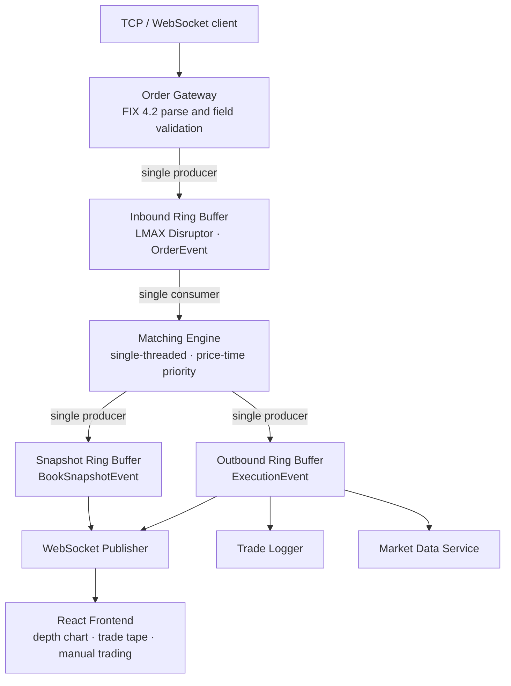

# Limit Order Management System

A low-latency limit order book and matching engine in Java, connected through an LMAX Disruptor
event pipeline to a FIX protocol gateway and a live React frontend.


This system implements the core of an exchange matching venue: raw FIX bytes arrive at a gateway,
cross a lock-free ring buffer into a single-threaded matching engine, match under price-time
priority, and fan out as execution and market-data events to a React trading interface over
WebSocket. It is a portfolio project, and every architectural decision is made to demonstrate the
skills that matter in trading-systems engineering: mechanical sympathy, lock-free data structures,
protocol-level networking, and disciplined scope.

The performance characteristics below are measured with JMH, not asserted. Each number is traceable
to a recorded benchmark run, and each is reported with its methodology and its caveats.

---

## Table of contents

- [Architecture](#architecture)
- [Performance](#performance)
- [Design principles](#design-principles)
- [Technology stack](#technology-stack)
- [Project structure](#project-structure)
- [Building and running](#building-and-running)
- [Benchmarking](#benchmarking)
- [Testing](#testing)
- [Scope](#scope)
- [Roadmap](#roadmap)

---

## Architecture

The pipeline is a single write path with no locks on the hot section. Each ring buffer has exactly
one producer, so write contention is eliminated by design rather than by synchronization.



**Order Gateway.** The protocol boundary. It receives raw bytes, parses FIX tag-value messages,
validates structure and required fields, and publishes `OrderEvent`s onto the inbound ring buffer.
It is the sole producer on that ring. Structural validation happens here; domain validation is
delegated to the `Order` constructor so the two concerns stay separated. Two message types are
supported: `NewOrderSingle` (35=D) and `OrderCancelRequest` (35=F).

**Inbound ring buffer.** A lock-free Disruptor transport between the gateway and the engine.
Carrier objects (`OrderEvent`) are pre-allocated and reused: the gateway copies fields into a slot,
the engine reads them out, and the slot is recycled. Single producer, single consumer.

**Matching Engine.** The core. It maintains the limit order book and executes price-time priority
matching on a single thread as the sole consumer of the inbound ring. No locks, no synchronization,
no contention. The book is a `TreeMap<Long, Deque<Order>>` per side (natural ordering for asks,
reverse ordering for bids), with an `ArrayDeque` at each price level for FIFO time priority and a
`HashMap<Long, Order>` for O(1) cancel lookup. Fills use the passive price convention (the resting
order's price). The engine has no knowledge of FIX, JSON, or WebSocket.

**Outbound and snapshot rings.** The engine is the single producer on two outbound Disruptor rings:
one carrying `ExecutionEvent`s (accepted, filled, partially filled, cancelled, rejected) and one
carrying `BookSnapshotEvent` depth snapshots. Each consumer holds its own sequence counter, so a new
subscriber is added by registering a consumer with no engine change.

**Publishers and frontend.** The WebSocket publisher serializes execution and snapshot events to
JSON via Jackson and pushes them to all connected React clients over Netty. A trade logger and a
market-data service subscribe independently on the same outbound ring. The React frontend renders a
live depth chart and trade tape, and submits orders back through the gateway.

---

## Performance

All figures come from JMH 1.37 on JDK 21.0.8 LTS. See [Benchmarking](#benchmarking) to reproduce.
Read the conditions column: these are single-fork measurements on an unpinned developer laptop, so
they are point estimates on one machine rather than certified benchmark results. Where a number
carries wide variance it is reported as a range with its confidence interval, never as a bare point
estimate.

| Measurement | Result | Conditions |
|---|---|---|
| Order insert latency | approximately 110 ns, flat from 1 to 10,000 resting orders | engine in isolation, `AverageTime` |
| Engine throughput | approximately 8.2M orders/sec (99.9% CI 7.7 to 8.7M) | blended rest/cross workload, book held shallow |
| Fill-walk cost | approximately 100 ns per price level consumed, O(N) | aggressive order walking N levels |
| Snapshot read path | 0 B/op (zero allocation) | top-of-book snapshot into a reused carrier |
| End-to-end latency | p50 4.8 µs, p99 9.5 µs, p99.9 18.3 µs | full pipeline, closed-loop service time |

**Book depth has no measurable effect on insert cost.** Inserting an order into a book holding 1
resting order and inserting into a book holding 10,000 resting orders cost the same within noise
(115 ns versus 147 ns, confidence intervals overlapping). This is consistent with the O(log N)
`TreeMap` insert being too small to resolve against per-operation noise. It is reported as "no
measurable degradation", not as "measured O(log N)", because the data does not resolve the trend.

**The fill path is genuinely O(N).** Unlike a single insert, an aggressive order that walks N price
levels costs proportionally more in both time and allocation (approximately 100 ns and approximately
120 bytes per level consumed). This is a real, resolvable per-level cost, not a trend read into
noise, and it is the honest counterpoint to the flat insert curve.

**End-to-end latency is transport-bound, not matching-bound.** The approximately 4.8 µs median for a
full gateway-to-execution round trip is dominated by the Disruptor consumer wakeup, the gateway
parse, and the inbound publish. The actual match plus trade construction plus publish is on the
order of 100 to 250 ns of that figure. The lever for this latency is the Disruptor wait strategy
(a busy-spin or yielding strategy would keep the consumer hot and collapse the median toward the
engine's sub-microsecond floor, at the cost of a burned core), not the engine itself. This is
measured as closed-loop service time with one order in flight, so it is not a saturation-latency SLA.

### Allocation, stated precisely

The system's zero-allocation claim is scoped honestly, because an unqualified version would be false
and is exactly what an interviewer probes.

- **Zero allocation holds for the ring transport.** Pre-allocated slots and reused mutable carriers
  mean the inbound-to-engine-to-outbound path allocates nothing in steady state.
- **Zero allocation also holds for the snapshot read path.** The `snapshotInto` method that fills a
  depth snapshot allocates 0 B/op after warmup. Its only allocations are non-escaping map and deque
  iterators, and the JIT's escape analysis scalar-replaces them. This was validated under JMH across
  book depths from 1 to 10,000 levels, with no garbage collection triggered across the entire run.
- **The matching engine's book structures do allocate.** A resting insert costs approximately 165
  B/op: a 56-byte `Order` plus approximately 109 bytes of collection-node and boxing overhead. The
  dominant cost is `Long` boxing at the `TreeMap` and `HashMap` boundary, where the `long`-cents
  discipline used everywhere else is undone. The known fix (primitive-keyed maps such as a
  `Long2ObjectRBTreeMap`) is a deliberate non-goal at this scale, and is documented as understood
  rather than as an outstanding task.

---

## Design principles

These are the invariants the implementation holds to, drawn from the system requirements.

1. **Zero allocation on the hot path.** Ring buffer slots are pre-allocated, event carriers are
   mutable and reused, and prices and timestamps are primitives. This eliminates GC pauses during
   matching. The scope of the claim is stated precisely above.
2. **Single-writer principle.** Each ring buffer has exactly one producer (the gateway inbound, the
   engine outbound), which removes write contention without locks.
3. **Mechanical sympathy.** Ring buffer slots are laid out for cache-line-friendly sequential
   access, Disruptor pads its sequence counters to prevent false sharing, and the engine reads
   events in order to maximize L1 and L2 cache hits.
4. **Logging off the hot path.** SLF4J logging occurs only at the boundaries (the gateway on receipt
   and the publisher on dispatch). The matching engine's inner loop contains no logging calls.
5. **Protocol boundary separation.** FIX parsing and JSON serialization happen only at the edges.
   The core pipeline operates on Java primitives and pre-allocated objects, and the engine has no
   knowledge of any wire format.
6. **Scope discipline.** A feature is included only if it serves the core goals of low-latency
   architecture, event-driven design, financial domain knowledge, or full-stack integration.
   Over-engineering is actively resisted.

---

## Technology stack

| Layer | Technology |
|---|---|
| Language | Java 21 LTS (bytecode target; developed on JDK 25) |
| Build | Maven |
| Concurrency transport | LMAX Disruptor ring buffers |
| Networking | Netty 4.2 (WebSocket server, `netty-codec-http`) |
| Serialization | Jackson 2.18 (JSON at the boundary) |
| Protocol | FIX 4.2 subset (`NewOrderSingle`, `OrderCancelRequest`) |
| Testing | JUnit 5 |
| Benchmarking | JMH 1.37 |
| Frontend | React (depth chart, trade tape, manual trading) |

A note on the JDK split: the code is developed on JDK 25 and compiled to Java 21 bytecode
(`maven.compiler.release=21`), and all published performance numbers are measured on JDK 21 LTS.
Percentiles on a non-LTS runtime are less defensible in a portfolio than the same numbers on the LTS
release a trading firm would actually pin, so 21 is the measurement target.

---

## Project structure

```
Limit-Order-Management-System/
├── app/
│   ├── backend/                                # Maven module — engine, gateway, pipeline, publishers
│   │   ├── pom.xml                             # Dependencies, Java 21 release target, JMH plugin
│   │   └── src/                                # main/java (below) and test/java (below)
│   └── frontend/                               # Vite + React trading terminal (independent build)
│       ├── package.json                        # Scripts and dependencies (npm)
│       ├── vite.config.ts                      # Dev server and build config
│       ├── index.html                          # Vite entry document
│       ├── src/                                # Application sources (below)
│       └── test/                               # Vitest component and unit tests
└── README.md
```

### Backend — main sources

```
app/backend/src/main/java/
├── Main.java                                   # Entry point — assembles the full pipeline and runs the demo server
├── model/
│   ├── Order.java                              # Mutable order; domain validation in the constructor
│   ├── Side.java                               # BUY / SELL
│   ├── Status.java                             # OPEN, PARTIALLY_FILLED, FILLED, CANCELLED
│   └── Trade.java                              # Immutable fill record (price in cents, both order ids)
├── engine/
│   ├── MatchingEngine.java                     # The book — price-time priority matching, single-threaded, framework-free
│   ├── BookView.java                           # Read-only top-of-book seam (best bid / best ask)
│   ├── ExecutionListener.java                  # Execution callback seam — primitives only, zero allocation
│   └── MatchingEngineHandler.java              # Disruptor adapter — OrderEvent in, ExecutionEvent + snapshots out
├── gateway/
│   ├── OrderGateway.java                       # Inbound ring producer — the FIX-wire / hot-path boundary
│   ├── FixParser.java                          # Hand-rolled FIX 4.2 tag-value parser (byte[] in, no framework types)
│   ├── FixFrameDecoder.java                    # Length-prefixed framing — emits one complete message at a time
│   └── FixConstants.java                       # SOH delimiter and the in-scope FIX tag numbers
├── event/
│   ├── OrderEvent.java                         # Mutable inbound carrier (gateway → engine)
│   ├── OrderEventFactory.java                  # Pre-allocates the inbound ring slots
│   ├── OrderEventType.java                     # NEW_ORDER / CANCEL_ORDER discriminator
│   ├── ExecutionEvent.java                     # Mutable outbound carrier (engine → subscribers)
│   ├── ExecutionEventFactory.java              # Pre-allocates the outbound ring slots
│   ├── ExecutionEventType.java                 # Accepted, filled, partially filled, cancelled, rejected
│   ├── BookSnapshotEvent.java                  # Mutable bounded top-N depth carrier
│   ├── BookSnapshotEventFactory.java           # Pre-allocates the snapshot ring slots
│   ├── InboundPipeline.java                    # Inbound Disruptor wiring — ring size and wait strategy
│   ├── OutboundPipeline.java                   # Outbound Disruptor wiring — independent consumers, own sequences
│   └── SnapshotPipeline.java                   # Snapshot Disruptor wiring — the depth feed
├── publisher/
│   ├── WebSocketPublisher.java                 # Fan-out — EXEC and BOOK frames as JSON to every connected client
│   └── TradeLogger.java                        # Server-side trade tape — logs fills, ignores everything else
├── net/
│   ├── WebSocketServer.java                    # Netty WebSocket server, exposes /ws
│   ├── WebSocketFrameHandler.java              # Per-connection handler — channel registration, inbound text frames
│   ├── JsonToFix.java                          # Manual JSON order → FIX 4.2 bytes, fed back through the real gateway
│   └── package_info.java                       # Package docs — the networking boundary
├── market/
│   └── MarketDataService.java                  # Snapshot consumer — best bid/ask, midpoint, spread
└── util/
    └── IDGenerator.java                        # Monotonic order / participant / trade ids
```

### Backend — tests and benchmarks

```
app/backend/src/test/java/
├── engine/
│   ├── MatchingEngineHandlerTest.java          # Adapter behaviour — inbound event to execution event
│   ├── MatchingEngineHandlerSnapshotTest.java  # Snapshot publication from the adapter
│   ├── MatchingEngineSnapshotTest.java         # snapshotInto correctness across book depths
│   └── MatchingEngineBookReadTest.java         # Top-of-book reads on an empty and a populated book
├── gateway/
│   ├── FixParserTest.java                      # Valid messages, missing tags, malformed input, SOH handling
│   ├── FixParserScanTest.java                  # Tag scanning over the raw byte buffer
│   ├── FixParserPriceTest.java                 # Decimal price → integer cents, no floating point
│   ├── FixParserChecksumTest.java              # Trailer (10=) validation
│   ├── FixFrameDecoderTest.java                # Framing — partial, split, and back-to-back messages
│   ├── JsonToFixParseTest.java                 # JSON order → FIX bytes the parser accepts
│   └── OrderGatewayTest.java                   # Publication onto the inbound ring
├── event/
│   ├── InboundPipelineTest.java                # Ring wiring, slot reuse, and field reset
│   ├── CapturingOrderHandler.java              # Test double — records OrderEvents off the ring
│   ├── CapturingExecutionHandler.java          # Test double — records ExecutionEvents
│   └── CapturingSnapshotHandler.java           # Test double — records BookSnapshotEvents
├── net/
│   ├── WebSocketServerTest.java                # Server bring-up and handshake
│   ├── WebSocketFrameHandlerTest.java          # Frame handling and channel-group registration
│   └── WebSocketRoundTripTest.java             # Client frame in, published frame out
├── publisher/
│   ├── WebSocketPublisherTest.java             # EXEC / BOOK JSON serialization and fan-out
│   └── TradeLoggerTest.java                    # Fills only reach the tape
├── market/
│   └── MarketDataServiceTest.java              # Midpoint and spread derivation
├── integration/
│   └── EndToEndPipelineTest.java               # FIX at the gateway through to an execution at a subscriber
└── benchmark/
    ├── MatchingEngineDepthBenchmark.java       # Insert latency as a function of book depth
    ├── MatchingEngineThroughputBenchmark.java  # Orders per second through the engine in isolation
    ├── MatchingEngineFillWalkBenchmark.java    # Cost of an order walking N price levels
    ├── MatchingEngineSnapshotBenchmark.java    # Whether the depth-snapshot read path allocates
    ├── OrderAllocationBaselineBenchmark.java   # The Order allocation floor, for subtraction
    └── EndToEndLatencyBenchmark.java           # Gateway-to-execution percentiles (gated closed-loop harness)
```

### Frontend

```
app/frontend/src/
├── main.tsx                                    # React entry point
├── App.tsx                                     # Single screen — one useOrderBook instance, the only frame sender
├── format.ts                                   # Cents ↔ dollars as string integer math, never floating point
├── components/
│   ├── Header.tsx                              # Instrument and top-of-book metrics, derived purely from BOOK
│   ├── DepthLadder.tsx                         # Depth ladder — asks above, bids below, BOOK only
│   ├── TradeTape.tsx                           # Newest-first fill tape, capped
│   ├── OrderEntry.tsx                          # Manual order entry — transient form state, emits cents
│   ├── OpenOrders.tsx                          # Working orders and the cancel intent
│   └── ConnectionBadge.tsx                     # connecting / open / reconnecting pill
├── protocol/
│   ├── messages.ts                             # The wire contract — the only place raw JSON becomes typed
│   └── encode.ts                               # Outbound frame construction and ClOrdID generation
├── state/
│   ├── reducer.ts                              # Pure state — BOOK replaces the book, EXEC never touches it
│   └── useOrderBook.ts                         # Socket lifecycle — capped-backoff reconnect, dispatches to the reducer
└── styles/
    └── terminal.css                            # Terminal styling
```

Maven runs from `app/backend/`, and npm runs from `app/frontend/`. The two build independently.

The matching engine is framework-free: the `event` carriers stay free of Disruptor types, and only
their `*Factory` classes touch `com.lmax`. This keeps the core testable in isolation with no ring
buffer or network in the loop.

---

## Building and running

**Prerequisites:** a JDK (21 or later), Maven, and Node.js for the frontend.

Backend:

```bash
cd app/backend
mvn clean install
mvn exec:java -Dexec.mainClass=Main
```

The backend stands up the Netty WebSocket server and the full pipeline. Connect a WebSocket client,
submit an order, and observe execution and book-snapshot frames pushed to subscribers.

Frontend:

```bash
cd app/frontend
npm install
npm run dev
```

The React client connects to the backend over WebSocket and renders the live depth chart and trade
tape.

---

## Benchmarking

Benchmarks live under `app/backend/src/test/java/benchmark/` and run through the JMH Maven plugin. They
never run as part of `mvn test`; invocation is explicit. Run them from `app/backend/` in a shell with
JDK 21 active:

```bash
export JAVA_HOME="/path/to/jdk-21"
export PATH="$JAVA_HOME/bin:$PATH"
java -version   # confirm 21.x before proceeding

mvn jmh:benchmark
```

Useful selectors (the plugin exposes the full JMH CLI as `jmh.*` properties):

```bash
# a single benchmark class
mvn jmh:benchmark -Djmh.benchmarks=MatchingEngineDepthBenchmark

# allocation profiling (reports gc.alloc.rate.norm in bytes per operation)
mvn jmh:benchmark -Djmh.benchmarks=MatchingEngineSnapshotBenchmark -Djmh.prof=gc

# more forks for tighter cross-JVM variance on the timing numbers
mvn jmh:benchmark -Djmh.f=3
```

The benchmark suite covers five questions, each in its own class:

| Benchmark | Question |
|---|---|
| `MatchingEngineDepthBenchmark` | insert latency as a function of book depth |
| `MatchingEngineThroughputBenchmark` | orders per second through the engine in isolation |
| `OrderAllocationBaselineBenchmark` | the `Order` allocation floor, for subtraction |
| `MatchingEngineFillWalkBenchmark` | matching cost when an order walks N price levels |
| `MatchingEngineSnapshotBenchmark` | whether the depth-snapshot read path allocates |
| `EndToEndLatencyBenchmark` | gateway-to-execution latency percentiles (closed-loop harness) |

The end-to-end latency harness is a gated JUnit runner rather than a JMH benchmark, because the
measured operation completes on a different thread from the one that starts it. It records the true
publication span into a pre-allocated array and sorts for exact percentiles. Run it with
`-De2e.latency=true`.

---

## Testing

The suite is 152 JUnit 5 tests covering the matching engine (placement, price-time priority, partial
and full fills, cancel, empty book), the FIX parser (valid messages, missing tags, malformed input,
SOH handling), the event carriers (correct field copying and reset across ring-buffer slot reuse),
and the full pipeline end to end (a FIX message at the gateway through to an execution event at a
subscriber).

```bash
cd app/backend
mvn test
```

---

## Scope

**In scope:** limit order matching with price-time priority, order submission and cancellation, a FIX
tag-value protocol subset, a Disruptor-based event pipeline, WebSocket push to a React frontend, and
JMH latency benchmarking.

**Out of scope, deliberately:** Spring Boot or any dependency-injection framework, AI trading agents,
persistence, multi-symbol and multi-venue routing, and authentication. These are omitted to keep the
project focused on the systems and domain concepts it exists to demonstrate.

---

## Roadmap

The core system, pipeline, gateway, WebSocket server, frontend, and benchmark suite are complete. The
remaining work is documentation and portfolio polish: the results write-up and resume artifacts.

Documented future direction, understood but out of scope at this stage:

- Primitive-keyed order book maps to remove the `Long` boxing measured on the insert and fill paths.
- A busy-spin or yielding Disruptor wait strategy to trade a core for lower median end-to-end
  latency under load.
- Multi-fork benchmark runs on a pinned, quiet machine to tighten the timing confidence intervals.

---